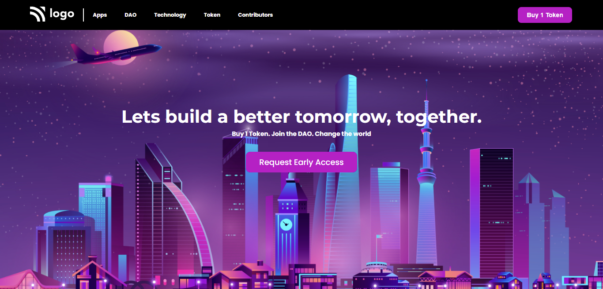

# Assignment - 05

## Project 05 [Live Link](https://full-stack-js-projects-05.netlify.app/)

- ### skills used in project
  - CSS Background images, media query, flexbox etc.
  - Learn to making background images responsive.
  - Total time taken 4hr to complete.
### Screenshot

### Mobile Responsive

